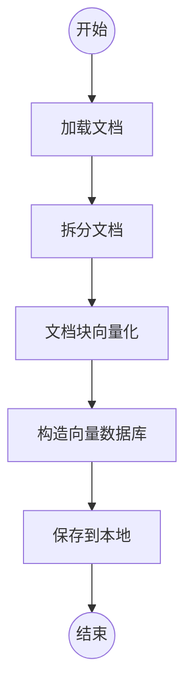

`tms-vecdb-kit`以`langchain`为基础，实现了基于语料建立和使用向量数据库的功能。

将文本资料加载到向量数据库中，可以用来实现语义搜索功能。资料中的内容向量化后用于语义搜索，元数据用于关键字匹配连接其他相关的数据。因此，加载资料时需要指定哪些部分是内容，哪些部分是元数据。语言大模型的向量空间是私有的，使用哪个大模型就要用它提供的接口做向量化。向量化接口有长度限制，执行向量计算前要将分档拆分为适当的大小。

讯飞星火向量接口：

- 文本长度不超过 256 个字符，超过会只截取前 256 个字符进行向量化

百度文心输入文本以获取 embeddings。说明：

- （1）文本数量不超过 16
- （2）每个文本长度不超过 384 个 token
- （3）输入文本不能为空，如果为空会报错

目前，支持加载的资料包括：csv 格式，json 格式和 wikijs。

目前，向量数据库使用`hnswlib`。它是个轻量级的内存数据库，可以把数据持久化在本地文件。

构造好向量数据库后，就可以实现语义检索。目前支持：

- 方式一：根据输入文本，按照语义从数据库中检索匹配的文档。
- 方式二：输入文本，按照语义从数据库中检索匹配的文档，将检索的文档作为提示内容传给大模型，由大生成回复内容。
- 方式三：输入文本，按照语义从数据库中检索匹配的文档，根据找到的文档再从文档库中按元数据检索。
- 方式四：直接输入元数据，从文档库中匹配文档。

在`Q&A`的场景中，如果需要根据用户的输入，从某个文档中，例如：用户手册，直接匹配答案，那么就使用方式一。但是方式一有个缺陷，文档加载时要控制大小，所在向量库的文本块可能不完整，不能直接作为回复，那么就可以使用方式四，让语言大模型基于检索的内容生成更自然的答案。如果，原始的资料问题和答案是分开，且需要给用户返回标准的答案，那么就采用方式三。

**注意**：当前版本的主要目的是进行技术和功能的验证，用于生产还需要考虑数据安全、性能、可维护性等问题。

# 编译

> pnpm i

> pnpm build

新建`.env`文件，指定语言大模型参数，目前支持百度文心和讯飞星火。

```
# 百度文心
BAIDUWENXIN_APP_ID=
BAIDUWENXIN_API_KEY=
BAIDUWENXIN_SECRET_KEY=
# 讯飞星火
XUNFEISPARK_APP_ID=
XUNFEISPARK_SECRET_KEY=
XUNFEISPARK_API_KEY=
# wikijs
WIKIJS_API_KEY=
```

# 资料加载

基于资料构造向量数据库的基本过程如下：



执行如下命令加载文件，并生成向量数据库。

```shell
DEBUG=\* node ./dist/build --type csv --file ./sample/data01-faq.csv --content q,a --meta id --store ./store/data01-faq-wx --model baiduwenxin
```

```shell
DEBUG=\* node ./dist/build --type json --file ./sample/data02-faq.json --content q,a --meta id --store ./store/data02-faq-wx --model baiduwenxin
```

```shell
DEBUG=\* node ./dist/build --type wikijs --url 'http://localhost:8444/graphql' --store ./store/wikijs-wx --model baiduwenxin
```

```shell
DEBUG=\* node ./dist/build --type json --file ./sample/data01-faq.csv --content q,a --meta id --store ./store/data01-faq-xf --model xunfeispark
```

```shell
DEBUG=\* node ./dist/build --type json --file ./sample/data02-faq.json --content q,a --meta id --store ./store/data02-faq-xf --model xunfeispark
```

```shell
DEBUG=\* node ./dist/build --type wikijs --url 'http://localhost:8444/graphql' --store ./store/wikijs-xf --model xunfeispark
```

| 参数    | 说明                                                    | 默认值 |
| ------- | ------------------------------------------------------- | ------ |
| type    | 数据类型，支持：json，csv 和 wikijs。                   | 无     |
| file    | 要加载的文件路径，适用于 json 和 csv。                  | 无     |
| url     | wikijs 的 api 地址。                                    | 无     |
| content | 作为内容的字段。csv 文件中的列，json 对象的字段路径。   | 无     |
| meta    | 作为元数据的字段。csv 文件中的列，json 对象的字段路径。 | 无     |
| store   | 生成的向量数据库存储路径。                              | 无     |
| model   | 使用的语言大模型。                                      | 无     |

参考：

https://docs.requarks.io/dev/api

# 检索数据

根据输入的文本和元数据过滤条件，返回匹配的文档

```shell
DEBUG=\* node ./dist/retrieve --model baiduwenxin --store ./store/data01-faq-wx --perset similarity --text xxxx --filter '{"/_pageContentSource":"q"}
```

根据指定的元数据过滤条件，返回匹配的文本

```shell
DEBUG=\* node ./dist/retrieve --model baiduwenxin --store ./store/data01-faq-wx --perset metadata --filter '{"/id":"1","/_pageContentSource":"q"}'
```

先根据输入的文本和过滤条件搜索相似的文档，再用文档的元数据信息进行向量库的元数据搜索

```shell
DEBUG=\* node ./dist/retrieve --model baiduwenxin --store ./store/data01-faq-wx --perset local-answer --text xxxx --filter '{"/_pageContentSource":"q"}' --match-by '/id' --filter2 '{"/_pageContentSource":"a"}'
```

将检索到的文本作为素材提供给大模型生成答案

```shell
DEBUG=\* node ./dist/retrieve --model baiduwenxin --store ./data05-faq-wx --perset llm-answer --text xxxx --filter '{"/_pageContentSource":"a"}'
```

# 计算向量

```shell
node ./dist/embedding --model baiduwenxin --text 介绍语言大模型
```

# 构造 docker 镜像

在项目根目录下执行

构造镜像

> docker build -t jasony62/tms-vecdb-kit .

在容器中执行

> docker run -it --rm --name tvk-test -v $PWD/.env:/usr/tms-vecdb-kit/.env -v $PWD/store:/usr/store jasony62/tms-vecdb-kit sh
